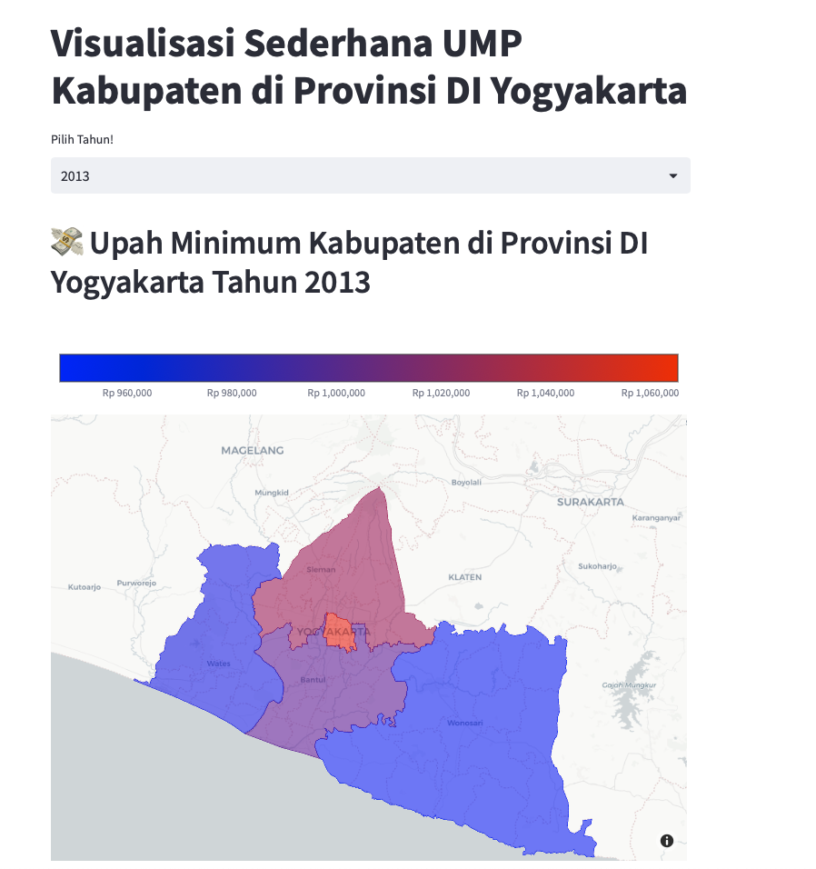

# Data Preparation and Visualization UMP Kabupaten in Provinsi DI Yogyakarta
Simple data preparation and visualization on UMP Kabupaten Provinsi DI Yogyakarta, for learning projects about how to preparing and how to turn data into something that people can read:

To DO:
1. Finish data Visualization (100% out of 100%)
2. Build basis visualization app using streamlit (100% out of 100%)

How to run streamlit app:
1. Clone this repository
2. create virtual env
3. inside virtual env, install depedencies using `pip install -r requirements.txt`
4. run the streamlit app using `streamlit run app.py`

## Streamlit APP UI

